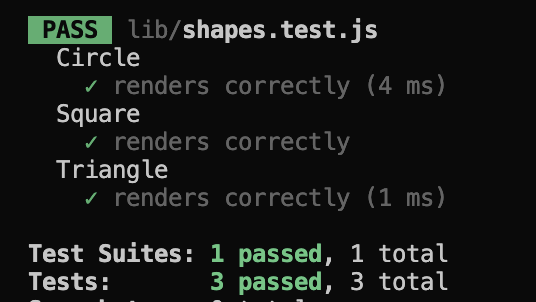

# SVG Logo Maker

## Description

This is an SVG logo maker which is a command-line tool that allows users to generate custom SVG logos in `.svg` files by choosing between shapes, colors, and text. This tool provides a simple and intuitive interface using Inquirer.js for collecting user input, and it generates SVG files that can be used for various purposes such as branding, website logos, or graphic designs.

Please refer to the _Usage_ section to watch a video on how to use the app.

## Table of Contents

* [Installation](#installation)
* [Usage](#usage)
* [Credits](#credits)
* [License](#license)
* [Contributing](#contributing)
* [Tests](#tests)
* [Questions](#questions)

## Installation

To install the SVG Logo Maker, follow these steps:

Pre-requisite
1. Have Node installed.

Steps
1. Clone the [svg-logo-maker](https://github.com/marcusmr15/svg-logo-maker) repository from GitHub
2. Navigate to the project folder
3. Run `npm install`  or `npm i` in the terminal or bash to install the required dependencies

## Usage

🎬 [Click here](https://drive.google.com/file/d/1ckZov6I42zR8Tu5z-Z7c-AwVGhEx7T_V/view?usp=sharing) to watch a video demonstrating the project’s intended usage.

1. Open your terminal
2. Navigate to the project folder
3. Run `npm i` to install node
4. Run `node index.mjs` to start the application
5. Answer the prompts to generate and svg file located within the `generated-logo` directory

## Credits

This project was created with the help of:
* The _Xpert Learning Assistant_ AI developed by __edX__.
* The _Chat GPT_ AI developed by __Open AI__.
* The [Thomas' Object Oriented Programming SVG LOGO MAKER](https://www.youtube.com/watch?v=GJYMcLus3v0&t=1s) YouTube video and the [Thomas-Object-Oriented-Programming-SVG-Logo-Maker](https://github.com/ThomasCalle/Thomas-Object-Oriented-Programming-SVG-Logo-Maker) repository by [Thomas Calle](https://github.com/ThomasCalle).

## License

* This project has no specific license. 
* This project was created by Marcos Munoz.

## Contributing

If you would like to contribute, please contact me (see the _Questions_ section) and follow these guidelines:

1. Fork the repository.
2. Create a new branch for your feature (`git checkout -b feature-name` in your terminal/bash).
3. Commit your changes (`git commit -am 'Add new feature'`).
4. Push to the branch (`git push origin feature-name`).
5. Create a new Pull Request.

## Tests

This project implements shape classes for Circle, Square, and Triangle, each equipped with a render() method that produces an SVG representation of the shape with a specified color (blue, green, and pink, respectively).

To execute these tests using the Jest testing framework, follow these steps:

1. Install Jest by running the following command in your terminal `npm install -g jest`
2. Once Jest is installed, you can run the tests by executing `npm test`. This command will trigger Jest to execute the tests defined in the shapes.test.js file.

When running the tests, you should expect to see the following results:

## Questions

* GitHub profile: [marcusmr15](https://github.com/marcusmr15).
* If you wish to connect with me and/or contribute to this or any of my other GitHub repositories, please contact me at marcos.munoz@saei.mx.
